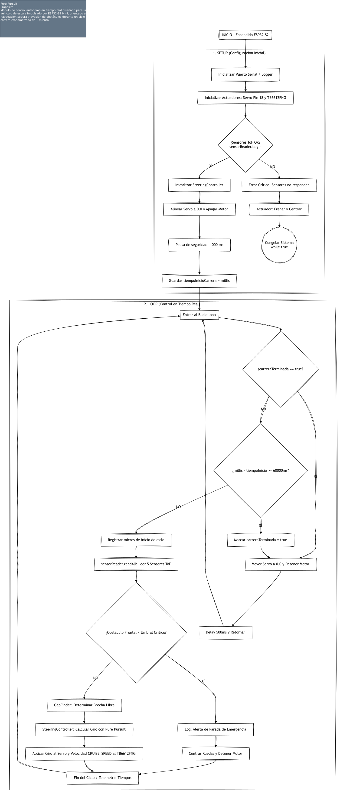
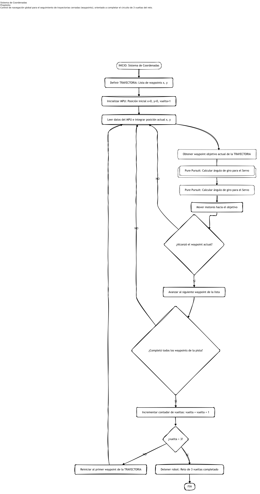
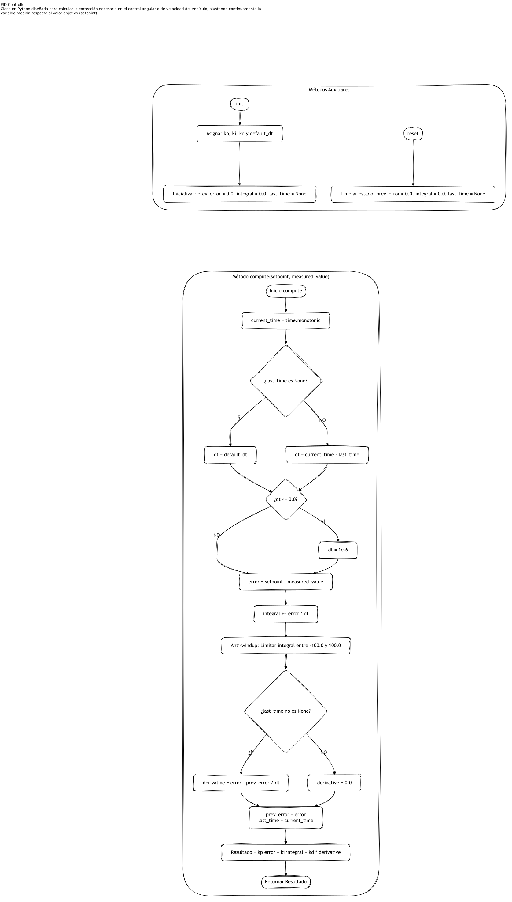

### Aquí podemos observar el proceso de nuestra estrategia de control mediante diagramas de flujo

**Evolución del Algoritmo de Control (Primer Desafío)**

A lo largo del desarrollo de Eva01, la estrategia de navegación fue adaptándose para optimizar la respuesta en tiempo real y mitigar fallos de medición.

- **Pure Pursuit**
Diseñado inicialmente para seguir geometrías de pista mediante cálculo de brecha libre (GapFinder) e interpolación de giros.

**Motivo del cambio:** Aunque reaccionaba a los sensores ToF, dependía excesivamente de lecturas relativas inmediatas sin una noción de orientación global ni de la trayectoria completa del vehículo. Para resolver esto y tener una navegación orientada a waypoints, migramos hacia un sistema de coordenadas.

- **Sistema de coordenadas** [Ver código](<../../src/python/1st - Coordinate System>)
Implementado para una navegación global basada en waypoints ($x, y$) predefinidos e integración de datos del MPU (IMU) para completar el circuito de 3 vueltas.

**Motivo del cambio:** La integración constante de los datos del MPU generó derivas acumulativas en la estimación de la posición actual ($x,y$), provocando pérdidas de precisión tras varias iteraciones y lecturas erróneas al alcanzar los waypoints.

- **PID** [Ver código](<../../src/python/1st - PID>)
Controlador en bucle cerrado basado en realimentación directa en tiempo real ($K_p$, $K_i$, $K_d$) con Anti-windup e integración de delta de tiempo ($dt$).

**¿Por qué nos quedamos con PID?:**  Ofrece una corrección continua y reactiva al instante frente a las diferencias medidas ($error = setpoint - measured\_value$), eliminando la acumulación de error por integración de coordenadas globales y garantizando un control estable, ligero y preciso en el servo de dirección y la velocidad.

