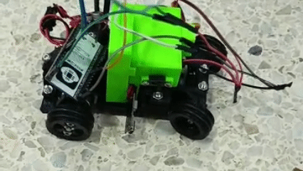

## Aquí podemos encontrar la evolución de nuestra fuente de energía

### Pruebas Iniciales de Alimentación y Sistema de Potencia

Al principio, nuestra opción de alimentación fue una batería de **litio de 3.7V y 1000 mAh**. Realizamos pruebas sencillas conectando la batería directamente a los motores y al controlador, pero notamos de inmediato que el Eva01 carecía de la fuerza y la velocidad necesarias para desplazarse adecuadamente.

Al analizar el comportamiento del circuito, identificamos los siguientes factores técnicos que afectaban el rendimiento:

**Limitación de corriente del módulo IP5306:** Utilizamos un módulo cargador/elevador para Power Bank (basado en el chip IP5306) para regular la salida de la batería a 5V. Sin embargo, este integrado está diseñado para electrónica de bajo consumo y carga de dispositivos, no para cargas inductivas. Al exigir torque a los motores, la corriente de arranque (inrush current) superaba el límite del módulo, activando sus protecciones internas y provocando caídas drásticas de tensión.

**Pérdida de eficiencia por doble regulación:** Intentar elevar los 3.7V de la celda a 5V con el módulo IP5306, para luego conectarlo al regulador elevador XL6019 e incrementar aún más la tensión, generó un cuello de botella energético considerable debido a las pérdidas acumuladas por conversión de potencia.

**Tasa de descarga de la batería:** La celda LiPo de 1000 mAh de una sola celda (1S) no lograba suministrar la tasa de descarga necesaria para mantener un flujo de corriente estable bajo demanda de carga mecánica.

**Picos de consumo por el servomotor:** Los servomotores generan picos de corriente (current spikes) al moverse bruscamente bajo carga mecánica. En esta etapa inicial, al compartir la misma línea débil de 5V proveniente del IP5306 con el microcontrolador y el puente H, los tirones de consumo del servo provocaban caídas de voltaje (brownouts) que reiniciaban la placa de control o hacían temblar la dirección por falta de potencia.

### Diagrama de Conexión Utilizado en las Pruebas

Debido a estas caídas drásticas de voltaje y los reinicios del sistema al exigir tracción a los motores y movimiento a la dirección, descartamos esta configuración e iniciamos el rediseño del sistema de alimentación hacia una fuente con mayor capacidad de descarga y respuesta en corriente.

### Vídeo demostrativo

> ℹ️ *Para visualizar nuestra siguiente opción, dirígete al apartado de [Fuente de alimentación](../../README.md#31-fuente-de-alimentación).*

