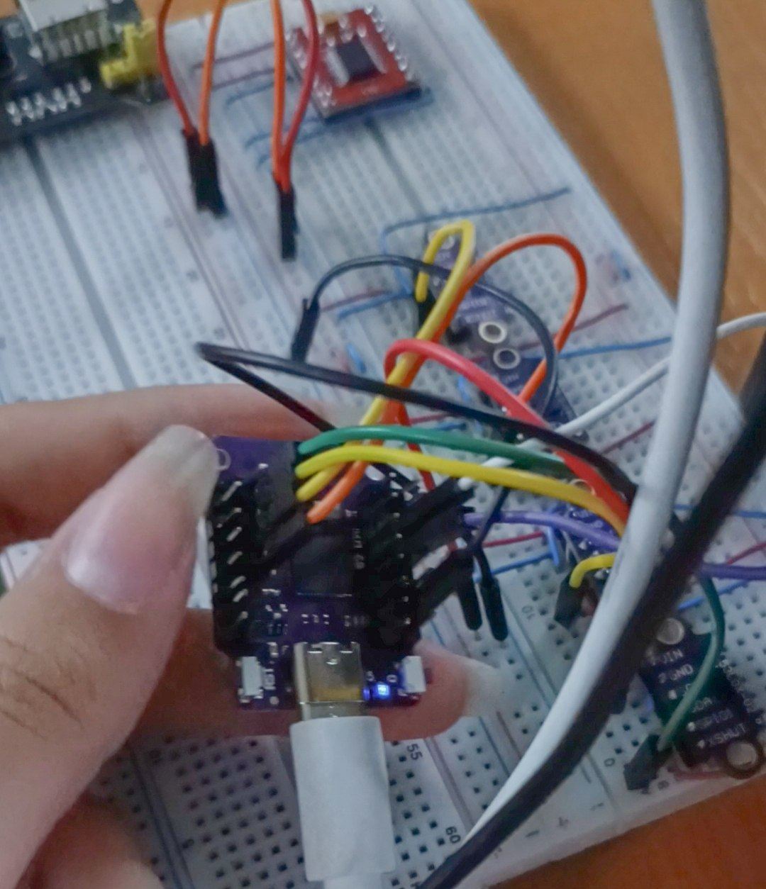
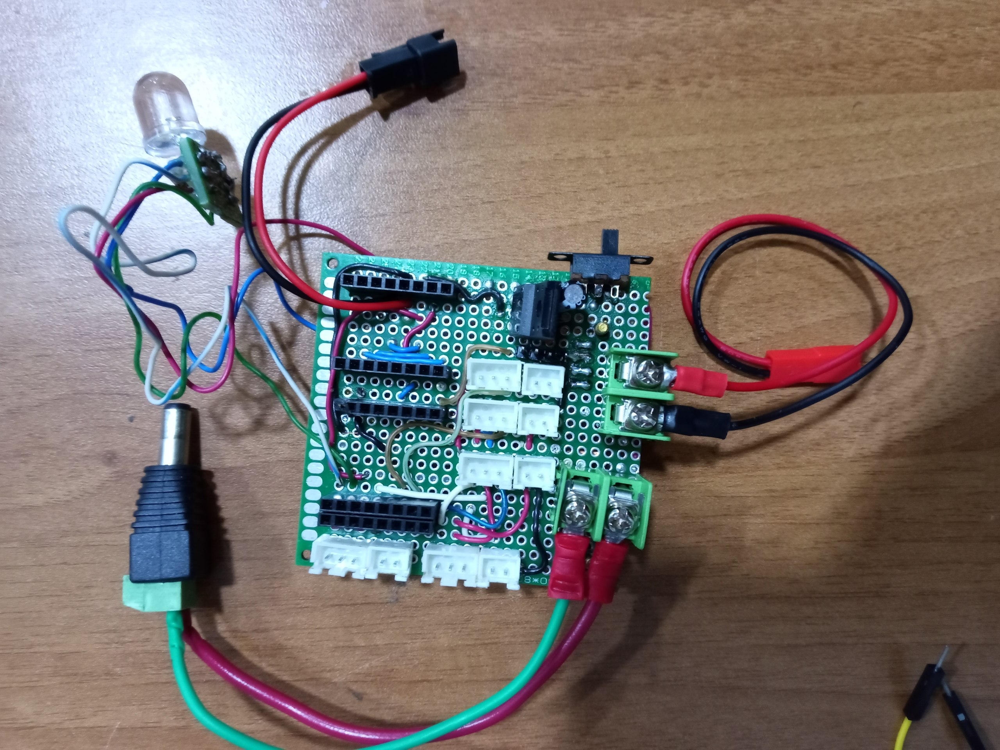
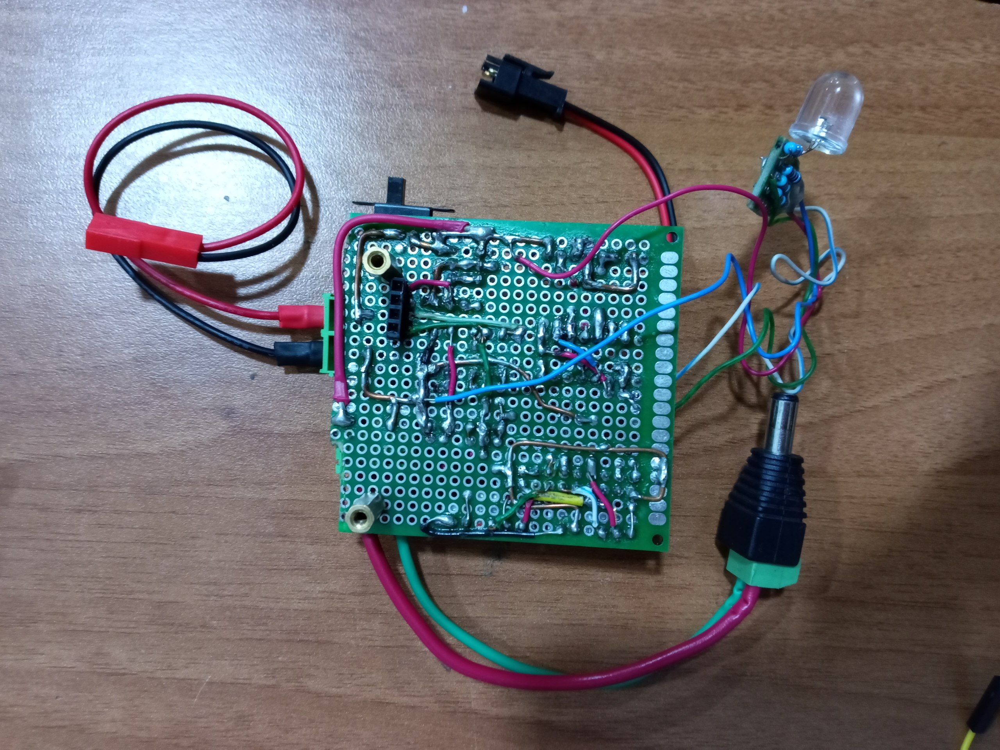

Para integrar los sensores, el giroscopio y los actuadores (servomotor y motor de tracción), se desarrolló una placa de circuito adaptada a las necesidades del vehículo. El primer paso consistió en ensamblar el circuito en una protoboard para validar el funcionamiento conjunto de todos los componentes.

Se conectaron en paralelo las líneas de alimentación y comunicación (`GND`, `VIN`, `SDA` y `SCL`), mientras que los pines `X-SHUT` de los sensores ToF se asignaron de forma independiente a pines GPIO del ESP32-S2 Mini. Durante la fase de pruebas mediante software, se verificó la correcta detección del MPU-6050 y de cada sensor en el bus I2C junto con sus lecturas de datos. Tras validar el circuito, se procedió al montaje definitivo sobre una placa perforada (*perfboard*).

Para la fabricación se utilizaron los siguientes materiales:

| Componente                             | Cantidad |
|--------------------------------------- |----------|
| Conectores JST  2 pines, Hembra-Macho  | 5        |
| Conectores JST  5 pines, Hembra-Macho  | 5        |
| Borneras de tornillo                   | 4        |
| Espadines macho 3 pines                | 1        |
| Espadines hembra 8 pines               | 5        |
| Cable coaxial                          | -        |
| Cable de red UTP (pares trenzados)     | -        |
| Perfboard                              | 1        |

*(Se extrajeron los conductores internos de cobre de los cables de red y el núcleo central del cable coaxial para realizar las interconexiones eléctricas).*

El ensamblaje se realizó sobre la placa perforada mediante la técnica de soldadura manual punto a punto. Los componentes principales (espadines, conectores JST y borneras) se fijaron en la cara superior, mientras que las interconexiones eléctricas, buses de alimentación y señales de control se enrutaron mayoritariamente por la cara posterior, soldando conductores de cobre rígido e hilos unifilares a cada terminal correspondiente.

### Circuito Terminado

### Reverso del Circuito

> ℹ️ *Para consultar el esquema de conexiones detallado, dirígete al apartado de [Diagramas Eléctricos](../../README.md#34-diagramas-eléctricos).*

### Distribución y Orden de los Sensores

La numeración del 1 al 5 representa la posición física de los sensores en el soporte impreso en 3D (ordenados de izquierda a derecha según el sentido de marcha). Las etiquetas **D1 a D5** del diagrama corresponden a los conectores en la placa donde van conectados cada uno.

### Consideraciones Técnicas sobre la Placa 

Al tratarse de una placa de circuito perforada ensamblada manualmente (sin grabado de pistas ni fabricación CNC), las uniones soldadas son más susceptibles al desgaste mecánico o a falsos contactos. Ante cualquier falla en el circuito, se recomienda verificar la continuidad de las líneas y los niveles de voltaje mediante un multímetro. Como mejora para futuras iteraciones, se planea el diseño y la fabricación de un PCB personalizado en fábrica para garantizar mayor estabilidad y robustez estructural.