# Team Génesis
<p align="center">

    <br>
    <i>Logo del Equipo</i>
</p>

<p align="center">

    <br>
    <i>Foto del Equipo</i>
</p>


# WRO - Future Engineers - Documentación del proyecto de robótica

## 👥Miembros del equipo
- **Johelis Acosta**
 *Rol*: Electrónica y mecánica
- **Miguel Mejías**
 *Rol*: Programador
- **Guillermo Fernández**
 *Rol*: Programador y diseñador

## 🧑🏻‍🔧Entrenador
- **Oswal Melean**
  *Ingeniero mecánico*

---

Bienvenidos a nuestro repositorio. Somos un grupo estudiantil dedicado a la robótica y la innovación, y en este espacio documentamos nuestro proceso de diseño: arquitectura de hardware, desarrollo de código, selección de componentes y el historial de pruebas de nuestro robot Eva01.

<a name="top"></a>

## 🔍Tabla de contenido

<!-- toc -->

- [1. 📚Descripción general](#1-descripción-general)
  - [1.1 Sobre el proyecto](#11-sobre-el-proyecto)
  - [1.2 Imagenes de Eva01](#12-imagenes-de-eva01)
  - [1.3 Video demostrativo](#13-video-demostrativo)
- [2. 🔩Movilidad y diseño mecánico](#2-movilidad-y-diseño-mecánico)
  - [2.1 Sistema de tracción](#21-sistema-de-tracción)
  - [2.2 Dirección](#22-direccion)
  - [2.3 Diseño del chasis](#23-diseño-del-chasis)
-  [3. 🔋Arquitectura de potencia y sensores](#3-arquitectura-de-potencia-y-sensores)
   - [3.1 Fuente de alimentación](#31-fuente-de-alimentación)
   - [3.2 Sensores y cámara](#32-sensores-y-cámara)
   - [3.3 Unidades de procesamiento](#33-unidades-de-procesamiento)
   - [3.4 Diagramas eléctricos](#34-diagramas-eléctricos)
   - [3.5 Consumo de energía](#35-consumo-de-energía)
- [4. 📐Arquitectura de software y estrategia para obstáculos](#4-arquitectura-de-software-y-estrategia-para-sortear-obstáculos)
  - [4.1 Reto abierto](#41-reto-abierto)
  - [4.2 Reto de obstáculos](#42-reto-de-obstáculos)
  - [4.3 Estacionamiento en paralelo](#43-estacionamiento-en-paralelo)
- [5. ⚙Pensamiento sistémico y decisiones de ingeniería](#5-pensamiento-sistémico-y-decisiones-de-ingeniería)
  - [5.1 Lenguajes de programación](#51-lenguajes-de-programación)
  - [5.2 Estructura del código](#52-estructura-del-código)
  - [5.3 Instrucciones de compilación](#53-instrucciones-de-compilación)
- [6. 📝Lista de componentes](#6-lista-de-componentes)
- [7. 💎Archivos de modelos 3D](#7-archivos-de-modelos-3d)
  - [7.1 Archivos STL](#71-archivos-stl)
  - [7.2 Archivos modificados](#72-archivos-de-slicer)
- [8. 🛠️Instrucciones de montaje](#8-instrucciones-de-montaje)


  
    <!-- tocstop -->

## 1. 📚Descripción general

### 1.1 Sobre el proyecto

Este proyecto se centra en el diseño, la construcción y la programación de un vehículo autónomo capaz de superar con precisión y rapidez los retos y obstáculos de la competición «WRO Future Engineers».

Para el equipo Genesis, este reto representa la oportunidad perfecta para poner en práctica la teoría, combinando la pasión por la innovación tecnológica con la resolución creativa de problemas a través de un proceso sistemático de investigación, creación de prototipos e iteración constante.

La estructura de nuestro robot **Eva01** se basa en una arquitectura robusta inspirada en el hardware *zcar* (https://github.com/alexyu132/zcar). Hemos sometido este diseño a un exhaustivo proceso de reingeniería utilizando Fusion 360 y Blender para optimizar las dimensiones de los alojamientos de tornillos y tuercas, así como para personalizar las piezas y lograr un ajuste perfecto de nuestros componentes.

El núcleo del sistema está controlado por una Raspberry Pi 3 B+, que gestiona la lógica principal, con el apoyo de un módulo ESP32 S2 Mini para controlar los sensores y actuadores. Para lograr una navegación precisa y una evitación eficiente de obstáculos, el robot integra sensores de tiempo de vuelo VL53L0X (ToF) junto con un giroscopio MPU-6050 para la estabilización y la orientación de la trayectoria.

Todo este proceso de desarrollo ha estado respaldado por una documentación detallada que no solo optimiza nuestro flujo de trabajo, sino que también demuestra nuestras habilidades técnicas y de colaboración, así como nuestro compromiso con el aprendizaje práctico.

---

### 1.2 Imagenes de Eva01

---

### 1.3 Video demostrativo

[Parte 1: Vídeo del reto abierto]()

[Parte 2: Vídeo del reto de obstáculos]()


<p align="right">
  <a href="#top">Back To Top</a>
</p>

---

## 2. 🔩Movilidad y diseño mecánico

- **Sistema de tracción:** tracción diferencial en 2 ruedas (ruedas traseras).
- **Dirección:** dirección en las ruedas delanteras mediante el servomotor MG90S.

### 2.1 Sistema de tracción

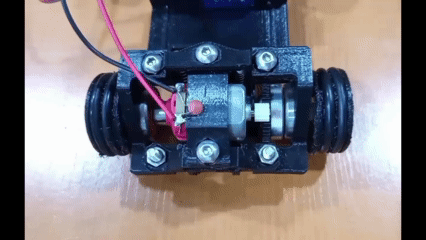

**Motor: Micro motor dc 130**

<table>
  <tr>
    <td align="center" width="300" >
   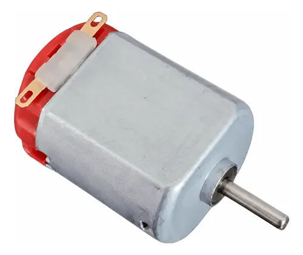
    </td>
    <td>
      <h3>Especificaciones:</h3>
      <ul>
          <li><b>Voltaje:3 V – 6 V</li>
          <li><b>Velocidad sin carga:12500 – 15000 RPM (a 6V)</li>
          <li><b>Stall torque:0,15 – 0,20 kg-cm</li>
          <li><b>Corriente sin carga:0,07 A – 0,15 A</li>
          <li><b>Relación de transmisión:1:1 (sin reductora)</li>
      </ul>
    </td>
  </tr>
</table>

**Motivo de la selección:**

- **Diseño compacto y liviano:** Permite optimizar al máximo el peso del chasis, manteniendo el centro de gravedad bajo y reduciendo la demanda sobre la batería durante las rondas de competencia.

- **Respuesta y aceleración rápida:** Presenta una baja inercia mecánica, facilitando aceleraciones inmediatas y cambios de velocidad.

- **Fácil integración:** Es una alternativa sumamente accesible, fácil de montar y rápida de reemplazar si se requiere mantenimiento durante las pruebas.

**Sistema de Tracción y Trabajo Futuro:**

El motor acciona las ruedas traseras a través de un eje metálico continuo de transmisión directa. Esta configuración garantiza que ambas ruedas reciban el mismo par y mantengan una velocidad sincronizada al 100%, eliminando descompensaciones en el avance en línea recta y evitando pérdidas por fricción de mecanismos complejos.

Aunque el eje rígido requiere compensar el radio de giro a través de la dirección delantera con el servomotor MG90S, la navegación actual depende completamente del control por sensores externos (VL53L0X y MPU6050). Si bien esta solución es económica y funcional para la etapa actual del prototipo, la falta de retroalimentación interna limita la precisión en el control de la distancia recorrida. Por ello, nuestra visión a futuro es reemplazar este por un motor con encoder integrado, lo que simplificará la programación y nos permitirá implementar un control mucho más preciso en pista.

**Montaje:**

Se instala mediante una abrazadera de motor impresa en 3D atornilladas al chasis. Esto permitirá futuras modificaciones para el mejoramiento de la tracción. 

[Abrazadera del motor](<models/Stls/Soporte motor.stl>)

- Cables del motor conectados directamente al puente h TB6612FNG.
- Ruedas conectadas a su tren de rodaje impreso en 3D con filamento PETG.

---

### 2.2 Dirección

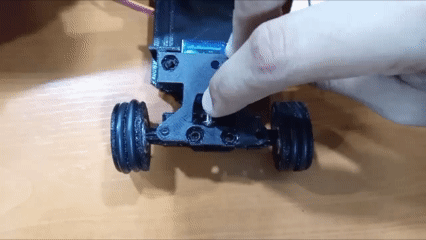

#### Servomotor: MG90S

<table>
  <tr>
    <td align="center" width="300" >
   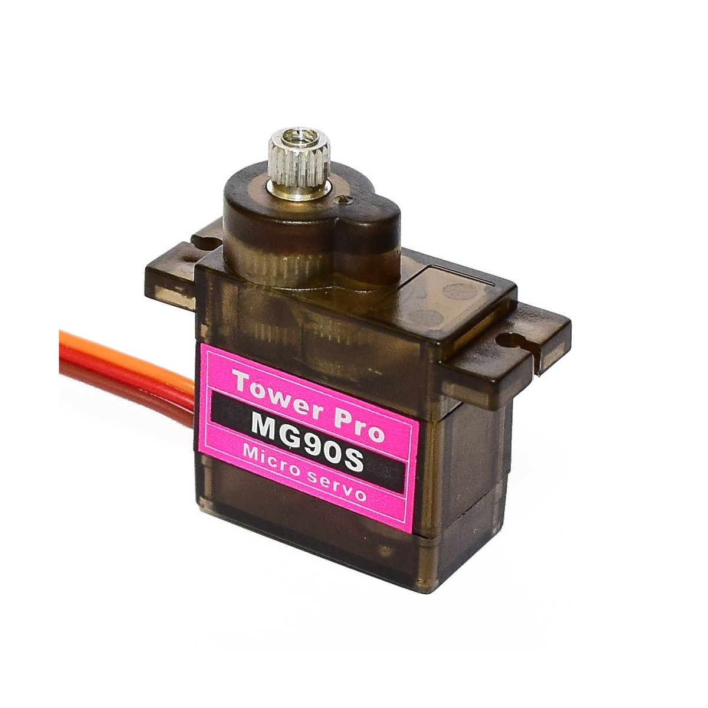
    </td>
    <td>
      <h3>Especificaciones:</h3>
      <ul>
          <li><b>Voltaje:4,8 V – 6,0 V</li>
          <li><b>Velocidad:0,08 – 0,10 s/60°</li>
          <li><b>Stall torque:1,8 – 2,2 kgf/cm</li>
          <li><b>Engranaje:Metal</li>
          <li><b>Tipo:Análogo / Digital</li>
      </ul>
    </td>
  </tr>
</table>

#### Motivo de la selección:

- Su pequeño tamaño y la interfaz PWM facilitan su control a través del ESP32-S2 Mini.

- Tiene el par de bloqueo (stall torque) suficiente para dirigir las ruedas delanteras con precisión.

- Ofrece un equilibrio entre velocidad y estabilidad durante los giros y los cambios de dirección.

- Este servomotor se utiliza ampliamente en la robótica, por lo que existe mucha documentación y kits de montaje disponibles.

Tomando como base el diseño modificado del hardware "zcar", adaptamos su dirección Ackermann para optimizar el paso por curva. Este sistema evita que los neumáticos deslicen al hacer que la rueda interior de la curva gire con un ángulo más pronunciado que la exterior.

El mecanismo funciona mediante un servomotor que desplaza un pin central a través de una ranura, empujando los brazos articulados de las ruedas. La clave radica en la inclinación del pin respecto a la barra de empuje: al mover el servo, se aplica una mayor diferencia angular a la rueda interna del giro. Así se logra un paso por curva fluido y preciso.


 *Imagen creada a partir de referencias de la web*
 
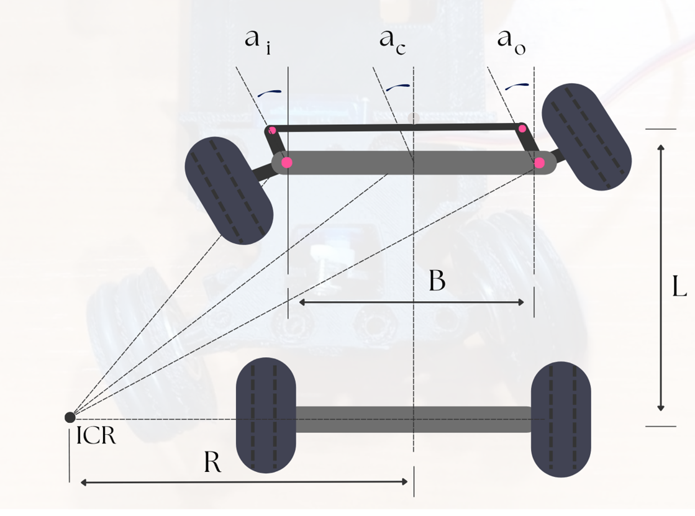

Describiremos a continuación el significado de cada término:

**ICR (Centro Instantáneo de Rotación):** Es el punto alrededor del cual el eje delantero está girando.

**R :** Es la radio del giro del vehículo, medida desde el ICR hasta el centro del eje trasero.

**L :** Es la distancia entre el eje delantero y el eje trasero de Eva01, o la distancia de nuestro eje transmisor.

**B :** Es la distancia entre los muñones de dirección (La pieza en la que va la rueda y se conecta a la dirección).

**a(i) :** Es el ángulo de giro de nuestra rueda interior respecto a la curva.

**a(o) :** Es el ángulo de nuestra rueda exterior respecto al giro.

Rediseñamos y mejoramos el mecanismo de dirección para satisfacer las demandas físicas y mecánicas del robot. Los aspectos clave de este desarrollo fueron:

- **Modelado en Autodesk Fusion 360:** Partimos del diseño base y utilizamos Fusion 360 para realizar las modificaciones geométricas necesarias en el sistema de dirección, adaptando componentes clave como la barra de la dirección y las dimensiones del muñón que sostiene las ruedas.

- **Prototipado rápido e iteración física:** Basamos nuestras pruebas en la fabricación directa de componentes. Imprimíamos en 3D las piezas modificadas en formato STL y evaluamos su desempeño en el chasis real; si un elemento no funcionaba según lo previsto (como requerir un mayor largo en la barra de dirección), ajustábamos el modelo 3D y volvíamos a imprimir.

- **Adaptación de rines y ruedas (Dirección vs. Tracción):** Para integrar de forma adecuada el eje metálico en el sistema de tracción trasera, adaptamos la geometría de los rines. Los rines delanteros (dirección) se diseñaron ligeramente más pequeños en diámetro interno, lo que hace que el perfil del neumático sea más grueso en esa zona; sin embargo, físicamente las ruedas delanteras y traseras mantienen exactamente el mismo tamaño externo para conservar el equilibrio y la altura del chasis.

- **Fabricación en PETG:** Todas las piezas adaptadas e impresas fueron fabricadas utilizando filamento PETG (a excepción de los neumáticos impresas en TPU), garantizando mayor resistencia mecánica, tenacidad ante impactos y durabilidad en las uniones y puntos de estrés térmico o mecánico.

#### Calibración e implementación

Para asegurarnos de que la dirección funcionara correctamente en ambas direcciones, llevamos a cabo un proceso de calibración práctico e iterativo:

- **Ajuste dimensional:** Modificamos de forma iterativa el modelo digital (ajustando la barra de dirección y el muñón) y probamos el encaje físico de las piezas impresas.

- **Verificación mecánica:** Tras cada impresión y montaje, evaluamos el comportamiento dinámico del servo y el varillaje, comprobando que las ruedas giraran de forma simétrica, sin fricción excesiva ni holguras en el muñón.

- **Consolidación del diseño:** Una vez alcanzado el ángulo de giro óptimo, fijamos las dimensiones definitivas en el modelo final.

#### Montaje:

Todo el mecanismo de dirección mejorado se ensambló de manera robusta utilizando un sistema de uniones impresas con filamento con tornillos y tuercas M3, sujetando firmemente el servo, los muñones y las barras de dirección a la estructura principal del chasis.

### 2.3 Diseño del chasis

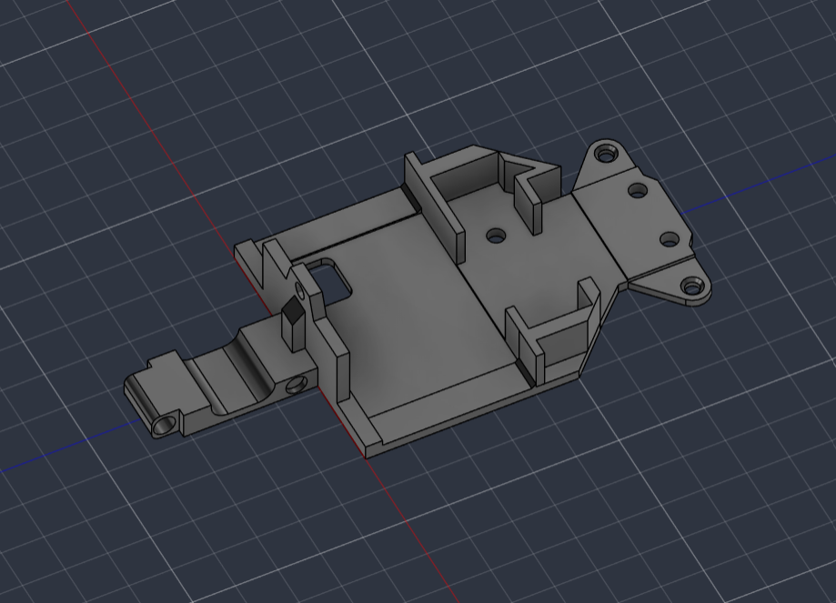

|**Dimensiones**|**Valor**|
|---------------|---------|
| Largo         | 126 mm  |
| Ancho         | 62 mm   |
| Alto máx      | 25.3 mm |
| Alto min      | 2.5 mm  |

**Diseño y Estructura del Chasis**

El chasis principal de nuestro vehículo toma como base un diseño de código abierto, el cual fue adaptado y optimizado mediante Autodesk Fusion 360 para ajustarse a nuestro sistema de tracción y geometría de dirección. Para garantizar la modularidad y facilitar el mantenimiento, la transmisión trasera y el mecanismo de dirección delantero con su servomotor se montan en placas desmontables impresas en 3D. Estas placas permitieron realizar ajustes finos durante la fase de pruebas hasta alcanzar una alineación precisa con el resto del tren motriz.

La distribución interna coloca los componentes de mayor peso en los extremos (motor y servo), reservando la zona central para la electrónica. Allí, una placa de circuito a medida simplifica el cableado y optimiza el espacio. El diseño se complementa con piezas independientes imprimibles, como abrazaderas para el motor y soportes dedicados para los sensores, lo que facilita el reemplazo o ajuste individual de cada elemento.

Todo el conjunto estructural fue impreso en filamento PETG, seleccionado por su mayor resistencia mecánica, durabilidad frente a impactos y tolerancia térmica en comparación con el PLA convencional.


<p align="right">
  <a href="#top">Back To Top</a>
</p>

---

## 3. 🔋Arquitectura de potencia y sensores

### 3.1 Fuente de alimentación

#### Batería high performance

<table>
  <tr>
    <td align="center" width="300" >
   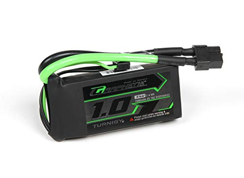
    </td>
    <td>
      <h3>Específicacones:</h3>
      <ul>
          <li>Modelo: Turnigy Graphene Panther</li>
          <li>Voltaje nominal: 7.4 V 2S</li>
          <li>Voltaje Máximo: 8.4 V (4.2 V por celda)</li>
          <li>Voltaje de Corte Seguro: 6.4 V - 6.6 V (3.2 V - 3.3 V por celda)</li>
          <li>Capacidad: 1000 mAh (1.0 Ah)</li>
          <li>Tasa de Descarga: 75C constante</li>
          <li>Tiempo de carga: 1.25 Horas</li>
      </ul>
    </td>
  </tr>
</table>


Para el Eva 01, diseñamos un sistema de distribución de energía centralizado a partir de una única batería, priorizando la estabilidad de la lógica de control frente al consumo de los motores.

Seleccionamos esta batería principalmente por su alta capacidad de entrega de corriente constante. Al trabajar con motores con tracción y un servomotor de dirección que se activan de forma simultánea, el sistema demanda picos de corriente muy elevados. La tecnología de esta batería nos garantiza que el flujo de energía sea masivo y constante, evitando caídas de tensión bruscas que podrían reiniciar o desestabilizar la Raspberry Pi 3 b+ o la ESP32-S2. Además, su excelente relación peso-potencia nos permite mantener el chasis ligero sin sacrificar la autonomía.

Para evitar que el ruido inductivo de los motores interfiriera con los procesadores, decidimos dividir la alimentación en tres ramificaciones independientes:


```text
                  ┌──► [Conversor Step-Down USB 5V] ──────► Raspberry Pi 3 B+ (Procesamiento)
                  │
[Batería LiPo 2S]─┼──► [Regulador Lineal LM7805] ────────► Servomotor (Dirección)
                  │
                  ├──► [Puente H TB6612FNG (Paralelo)] ──► Motor DC 6V (Tracción)
                  │         └─► [ESP32-S2] (Lógica)
                  │
                  └──► [Divisor de Tensión] ────────────► Pin 14 ESP32-S2 (Monitoreo)
```

- **Alimentación de la Raspberry Pi 3 B+**
Utiliza un **conversor regulador (Step-Down) doble USB** conectado directo a la batería, garantizando el suministro estable de 5V y el amperaje continuo que requiere la Pi para procesar datos sin caídas de voltaje.

- **Incremento de Torque (Puente H en Paralelo)**
Para maximizar la fuerza del motor de tracción de 6V, **conectamos en paralelo ambos canales del puente H TB6612FNG** (puenteando señales de control y salidas de potencia). Esto duplica la capacidad de corriente, evitando sobrecalentamientos ante altas exigencias mecánicas. La ESP32-S2 toma su alimentación lógica de esta etapa.

- **Aislamiento del Servomotor de Dirección**
Alimentamos el servomotor de forma exclusiva con un regulador lineal **LM7805** para aislar por completo el ruido que generan sus movimientos rápidos, protegiendo la estabilidad de los microcontroladores.

- **Monitoreo y Protección de la Batería**
Implementamos un **divisor de tensión** conectado a un pin 14 de la ESP32-S2 para medir el voltaje de la batería de forma segura. Si el nivel de carga desciende de su límite crítico, el sistema activa un **LED de advertencia** para evitar la degradación de las celdas.

#### Conversor regulador (Step-Down) doble USB

<table>
  <tr>
    <td align="center" width="300" >
   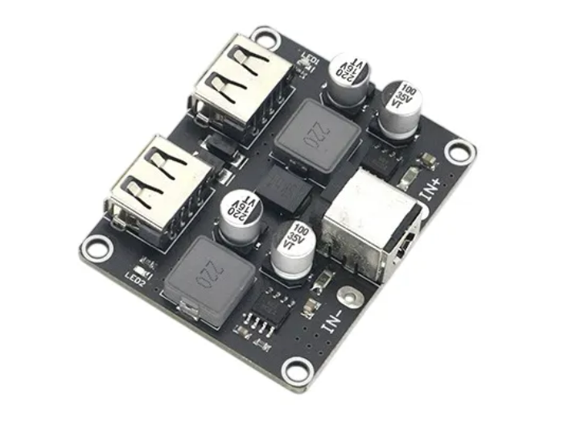
    </td>
    <td>
      <h3>Especificaciones:</h3>
      <ul>
          <li><b>Rango de voltaje de entrada:6 V – 32 V DC</li>
          <li><b>Voltaje de salida:5 V por defecto (3 V – 12 V en carga rápida)</li>
          <li><b>Potencia de salida máxima:24 W por puerto (ej. 5V/3.4A, 9V/2.5A, 12V/2A)</li>
          <li><b>Eficiencia de conversión:90% – 97%</li>
      </ul>
    </td>
  </tr>
</table>


#### Controlador del motor: TB6612FNG

<table>
  <tr>
    <td align="center" width="300" >
   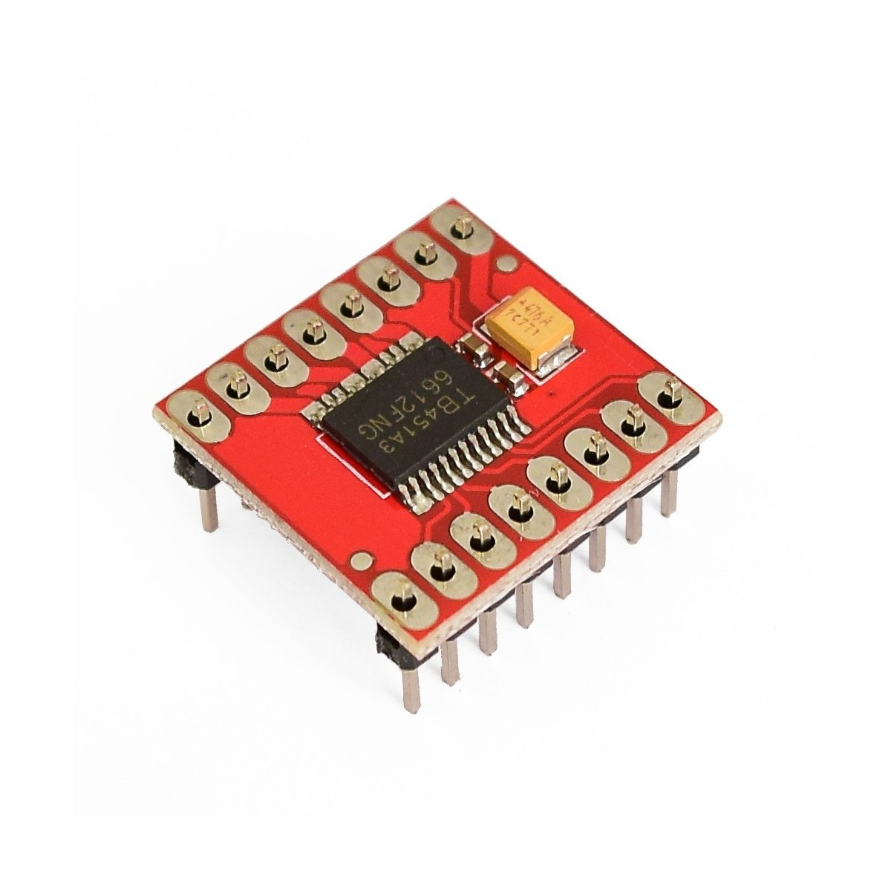
    </td>
    <td>
      <h3>Especificaciones:</h3>
      <ul>
          <li><b>Rango de voltaje de motores (VM): 4.5 V – 13.5 V</li>
          <li><b>Voltaje de lógica (VCC): 2.7 V – 5.5 V</li>
          <li><b>Corriente de salida continua: 1.2 A por canal (2.4 A en paralelo)</li>
          <li><b>Corriente pico máxima: 3.2 A por canal</li>
          <li><b>Resistencia típica R<sub>DS(on)</sub> (alta + baja):</b> 0.5 Ω</li>
          <li><b>Frecuencia máxima de PWM: Hasta 100 kHz</li>
      </ul>
    </td>
  </tr>
</table>

#### Regulador lineal: LM7805

<table>
  <tr>
    <td align="center" width="300" >
   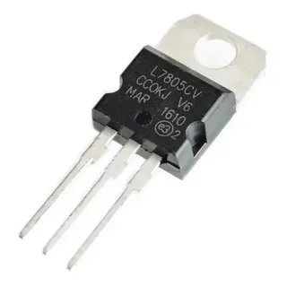
    </td>
    <td>
      <h3>Especificaciones:</h3>
      <ul>
          <li><b>Voltaje de salida:5 V DC (fijo)</li>
          <li><b>Rango de voltaje de entrada:7 V – 25 V</li>
          <li><b>Corriente de salida máxima:1.5 A</li>
      </ul>
    </td>
  </tr>
</table>


---

### 3.2 Sensores y cámara

#### Sensor tiempo de vuelo VL53L0X

El VL53L0X es un sensor de distancia pequeño y muy utilizado que emplea la tecnología de tiempo de vuelo (ToF) para medir la distancia a un objeto mediante la emisión de un pulso de luz láser infrarroja invisible y el cálculo del tiempo que tarda en regresar.

Lo hemos elegido para este proyecto debido a tres ventajas clave:

-  **Tamaño ultracompacto**: su reducido tamaño permite integrarlo fácilmente en espacios reducidos sin comprometer el diseño del prototipo.
  
-  **Fácil integración**: ofrece una excelente compatibilidad y bibliotecas listas para usar, lo que simplifica enormemente la programación.
  
-  **Alta velocidad**: es capaz de realizar mediciones de distancia por láser en un tiempo récord, lo que garantiza lecturas rápidas, precisas y en tiempo real.

  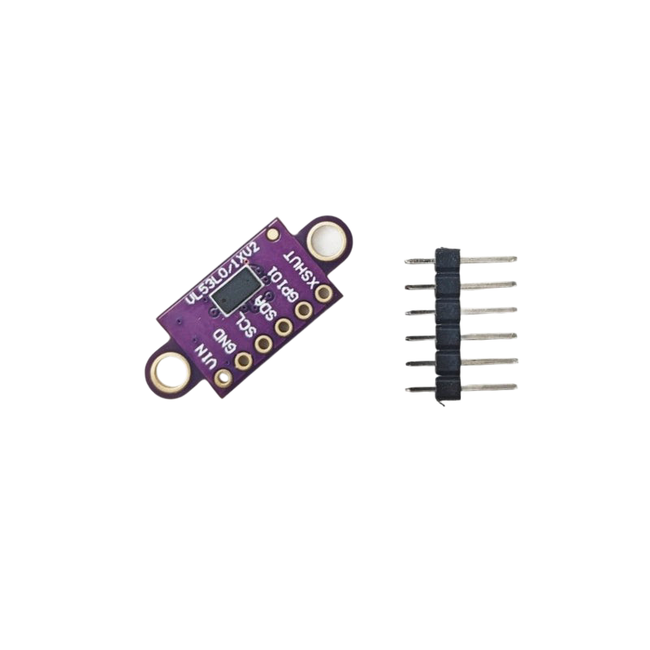


|**Dimensiones**|**Valor**|
|---------------|---------|
| Largo         | 25 mm   |
| Alto          | 1 mm    |
| Ancho         | 10,7 mm |
| Peso          | 0,8 g   |

  
#### Sensor de unidad de medición inercial (IMU MPU-6050)

El MPU-6050 es una unidad de medición inercial (IMU) muy utilizada que integra un giroscopio de 3 ejes y un acelerómetro de 3 ejes en un único chip. Utiliza esta combinación para medir con precisión la aceleración lineal y la velocidad angular, lo que permite determinar la orientación, la inclinación y el movimiento del prototipo en el espacio.

Ventajas clave del dispositivo:

- **Tamaño ultracompacto**: al integrar el acelerómetro y el giroscopio en una placa minúscula, maximiza la eficiencia del espacio dentro de nuestro circuito.
  
- **Fácil integración**: gracias a la comunicación mediante el protocolo I2C y a una amplia gama de bibliotecas disponibles, la configuración y la lectura de datos son extremadamente sencillas.
  
- **Alta velocidad**: cuenta con un procesador de movimiento digital (DMP) interno que ejecuta rápidamente algoritmos complejos, proporcionando datos estables en tiempo real sin sobrecargar el microcontrolador principal.

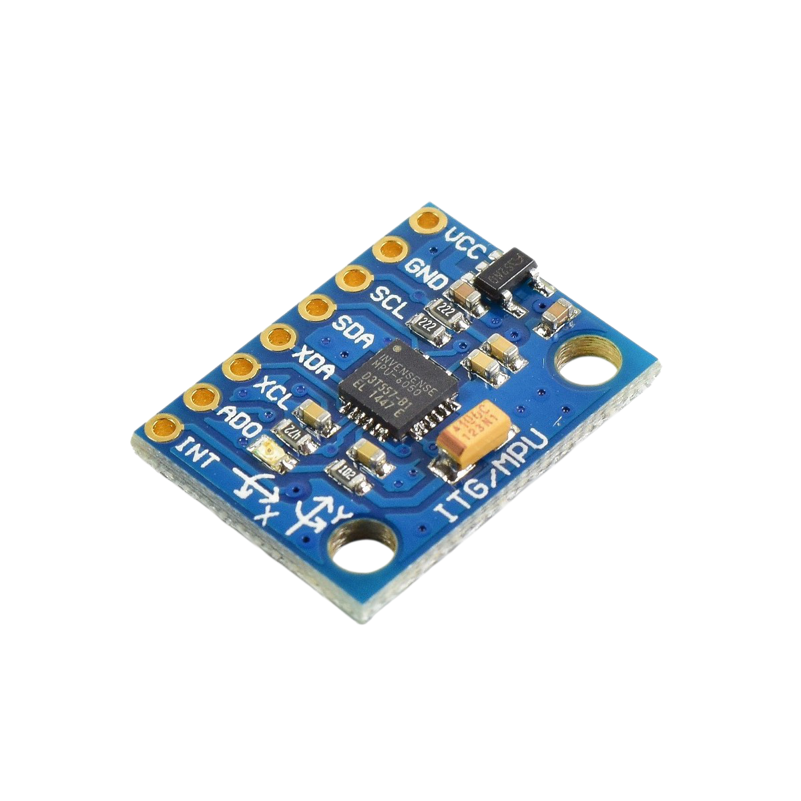


|**Dimensiones**|**Valor**|
|---------------|---------|
| Largo         | 21.2 mm |
| Ancho         | 16.4 mm |
| Alto          | 3.3 mm  |
| Peso          | 2.1 g   |

#### Cámara de visión artificial (cámara web FHD de 1080p modificada)

Para equipar el vehículo con un sistema de visión artificial, integramos una cámara web de alta definición (FHD de 1080p). Sin embargo, dado que la unidad comercial original (incluidas su carcasa y su soporte) era demasiado grande y pesada (80 mm x 33 mm x 40 mm), llevamos a cabo una modificación del hardware eliminando toda la estructura plástica externa. Esto nos permitió extraer el módulo interno de la cámara, lo que dio como resultado una placa de circuito funcional que mide tan solo **25 mm x 28,5 mm**.

Ventajas clave del dispositivo modificado:

- **Tamaño ultracompacto (tras la modificación)**: al reducir drásticamente sus dimensiones a tan solo 25 mm x 28,5 mm, pudimos montarlo en la parte delantera del vehículo sin comprometer la aerodinámica ni el diseño del chasis.
  
- **Fácil integración y estabilidad**: A pesar de estar desmontado, conserva la conectividad USB nativa y la compatibilidad directa con algoritmos de visión por ordenador (como OpenCV), lo que simplifica la programación.
  
- **Alta velocidad y resolución**: Mantiene la captura en 1080p FHD, procesando imágenes nítidas en tiempo real, un factor crítico para la toma de decisiones mientras el vehículo está en movimiento.

#### Comparación de dimensiones (cámara web)


<div align="left">
 <i>Antes</i>
 <br>
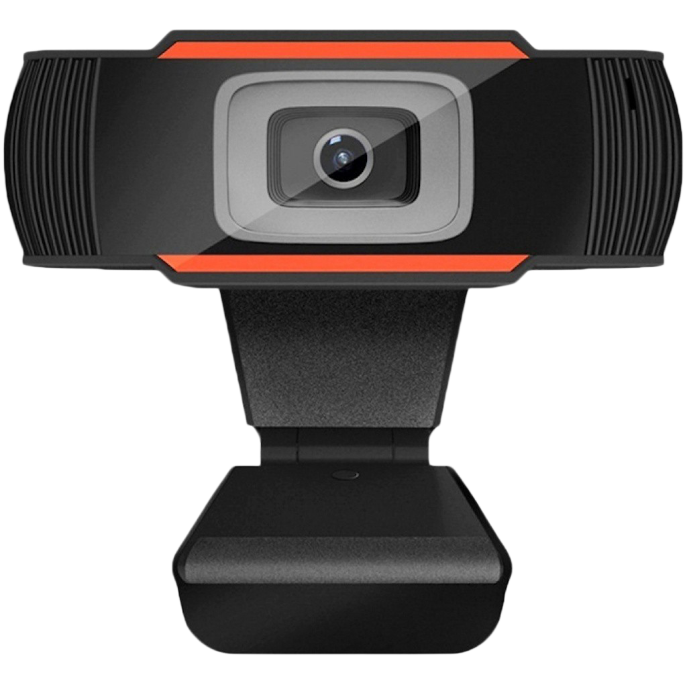
</div> 


|          **Estado**          |**Largo** |**Ancho**|**Alto**|
|------------------------------|----------|---------|--------|
| Con carcasa (original)       | 80 mm    | 40 mm   | 33 mm  |


<div align="left">
 <i>Después</i>
 <br>
 
</div>
  
 
|          **Estado**          |**Largo** |**Ancho**|**Alto**|
|------------------------------|----------|---------|--------|
| Sin carcasa (modificado)     | 25 mm    | 28,5 mm | 2 mm   |

---

### 3.3 Unidades de procesamiento 

#### Raspberry Pi 3 b+

Equipada con un procesador ARM Cortex-A53 de 64 bits y 1,4 GHz, **la Raspberry Pi 3 B+** es nuestro controlador principal. Decidimos utilizar la Raspberry Pi 3 B+ por varias razones, entre ellas:

- **Compatibilidad**: hay muchos componentes (como las cámaras web USB estándar) que son fáciles de integrar con la Raspberry Pi 3 B+.
  
- **Potencia**: la Raspberry Pi 3 B+ ofrece un rendimiento eficiente y equilibrado; gracias a ello, el dispositivo gestiona con facilidad tareas exigentes, como el procesamiento de imágenes en tiempo real.
  
- **Portabilidad**: La Raspberry Pi 3 B+ destaca entre los controladores; con un peso de tan solo 45 g, es ligera, lo que la convierte en una opción práctica y fiable para su integración en el Eva 01.

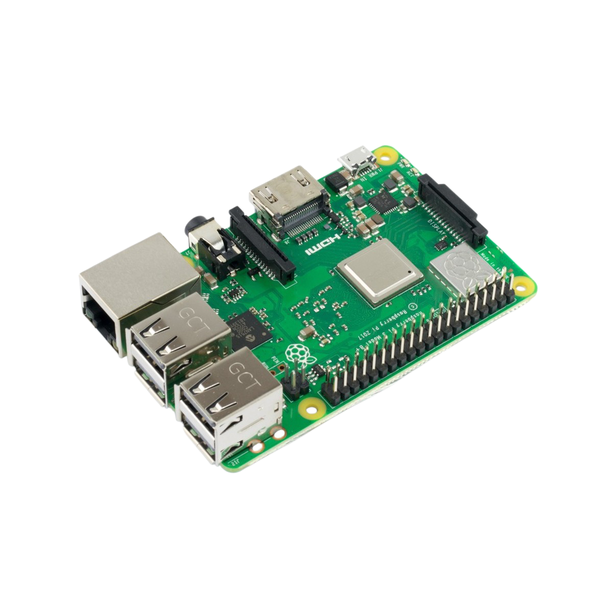


|**Dimensión**|**Valor**|
|-------------|---------|
| Longitud    | 85 mm   |
| Altura      | 17 mm   |
| Anchura     | 56 mm   |
| Peso        | 45 g    |

#### Esp32-S2 Wemos Mini

Aunque la Raspberry Pi 3 B+ es capaz de procesar imágenes en tiempo real, nos dimos cuenta de que necesitaba algo de ayuda para evitar que se sobrecargara de información; por ello, decidimos incorporar un **ESP32-S2 Mini** para controlar los sensores y sus actuadores con el fin de alcanzar el nivel de procesamiento necesario. Asimismo, aprovechamos la conectividad Wi-Fi integrada de este microcontrolador para transmitir y visualizar en tiempo real (únicamente  durante las prácticas) las lecturas de los sensores a través de una app realizada en Firebase.

 


|**Dimensión**|**Valor**|
|-------------|---------|
| Longitud    | 34.3 mm |
| Altura      | 25.4 mm |
| Anchura     | 25.4 mm |
| Peso        | 5.3 g   |


### 3.4 Diagramas eléctricos

**Diagrama de Bloques del Sistema**


---

**Diagrama sensores:**


---

**Diagrama motores:**


---

**Diagrama divisor de voltaje:**


---

Tuvimos que decidir cómo integrar todo el circuito. Si dejábamos los componentes separados y conectados solo con cables sueltos, el sistema ocupaba demasiado espacio y resultaba muy desordenado. Por ello, optamos por diseñar y ensamblar nuestra propia placa soldando todo sobre una perfboard. Esto nos permitió compactar considerablemente el circuito, mantener las conexiones ordenadas y fijas, y al mismo tiempo conservar la flexibilidad para corregir fallas o reemplazar componentes sin tener que rediseñar una PCB industrial.

---

### 3.5 Consumo de energía

| Componente                    | Alimentación (V)  | Corriente Típica         | Corriente Pico    | Potencia Típica (W) |
|-------------------------------|-------------------|--------------------------|-------------------|---------------------|
| Raspberry Pi 3 Model B+       | 5.0 V             | 500 – 1000 mA            | 2.50 A            | 2.50 – 5.00 W       |
| ESP32-S2 Mini                 | 3.3 V / 5.0 V     | 70 – 100 mA              | 310 mA            | 0.23 – 0.50 W       |
| Cámara USB (1080p)            | 5.0 V             | 100 – 250 mA             | 300 mA            | 0.50 – 1.25 W       |
| Sensor ToF VL53L0X            | 3.0 – 5.0 V       | 19 mA                    | 40 mA             | 0.06 W              |
| IMU MPU-6050                  | 3.3 – 5.0 V       | 3.8 mA                   | 5 mA              | 0.012 W             |
| Servomotor MG90S              | 4.8 – 6.0 V       | 100 – 300 mA             | 700 – 800 mA      | 0.50 – 1.50 W       |
| Micromotor DC 130             | 3.0 – 6.0 V       | 150 – 250 mA             | 0.80 – 1.20 A     | 0.75 – 1.50 W       |
| Driver Puente H TB6612FNG     | 2.7–5.5 V / 15.0 V| 3 mA                     | 1.20 A (por canal)| Variable            |
| Conversor Buck Step-Down 5V   | 6.0 – 32.0 V      | 10 – 20 mA *(quiescente) | 3.00 A (máx.)     |η ≈ 90% – 95%        |
| Regulador Lineal LM7805       | 7.0 – 25.0 V      | 5 mA *(quiescente)*      | 1.50 A            | Variable            |
| Capacitores (47 µF / 10 µF)   | N/A *(filtrado)*  | Pasivo (0 A)             | Pasivo            | N/A                 |


<p align="right">
  <a href="#top">Back To Top</a>
</p>

--- 

## 4. 📐Arquitectura de software y estrategia para obstáculos

En esta competición hay dos retos:

- El **Desafío abierto** consiste en que el robot complete tres vueltas completas al circuito sin tocar la pared. Las dimensiones de cada lado del circuito y la dirección en la que circula el coche se determinan al azar.
- El **Desafío con obstáculos** exige que el robot complete tres vueltas evitando las señales de tráfico. Si la señal es roja, el robot debe circular por el lado derecho; si es verde, debe circular por el lado izquierdo. La dirección en la que circula el carrito y la ubicación de las señales se determinan al azar. Tras la tercera vuelta, el carrito debe encontrar la zona del estacionamiento y estacionarse en ella sin tocar las barreras que la rodean.

Nuestra implementación se basa en gran parte en los sensores y cámara para realizar un escaneo continuo del entorno, lo que ayuda al algoritmo a determinar el movimiento del robot.

Dividimos la estrategia en tres fases:

- Desafío abierto
- Desafío de obstáculos
- Maniobra de estacionamiento en paralelo

---

### 4.1 Reto abierto

El Desafío Abierto requiere que el robot complete tres vueltas alrededor de la arena sin tocar las paredes. La dirección de conducción es aleatoria al inicio, por lo que no es factible depender de movimientos preprogramados.

El robot determina en qué dirección girar analizando las paredes detectadas a su alrededor, el algoritmo funciona de la siguiente manera:


### 4.2 Reto de osbtáculos

---

### 4.3 Estacionamiento en paralelo

<p align="right">
  <a href="#top">Back To Top</a>
</p>

---

## 5. ⚙Pensamiento sistémico y decisiones de ingeniería

### 5.1 Lenguajes de programación

#### Arduino IDE


Al principio utilizamos Arduino IDE para programar la ESP32-S2 Mini de Eva 01 durante el primer desafío. Sin embargo, no tomamos en cuenta que la comunicación serie y la integración con la Raspberry Pi 3 Model B+ resultaría compleja bajo este enfoque.

La Raspberry Pi 3 B+ ejecuta un sistema operativo completo (Raspberry Pi OS) y trabaja principalmente en Python, mientras que el código compilar con Arduino IDE está escrito en C/C++ (C++ simplificado). Esta disparidad exigía implementar protocolos de comunicación serie (UART o USB-CDC) con librerías adicionales como pyserial para parsear, estructurar y sincronizar constantemente las tramas de datos entre ambos entornos.

Además, la arquitectura nativa en C/C++ generaba barreras al intentar modificar o depurar algoritmos al vuelo durante las pruebas del robot. El cambio hacia un entorno unificado basado en Python / MicroPython facilitó la interacción, ya que ambos sistemas pueden compartir lógica, estructuras de datos y protocolos sin la necesidad de traducir el flujo entre dos lenguajes de programación distintos.

[Toca aquí para ver el código del primer desafío en Arduino](<src/Arduino IDE>)


#### Thonny 


Thonny es un Entorno de Desarrollo Integrado (IDE) gratuito y de código abierto diseñado específicamente para programar en Python y MicroPython de manera sencilla. Viene preinstalado de fábrica en el sistema operativo Raspberry Pi OS, por lo que es la herramienta que estamos utilizando actualmente en la Raspberry Pi 3 Model B+ y la ESP32 S2 Mini.

Su principal ventaja es que cuenta con un soporte integrado para gestionar una amplia variedad de librerías y conectarse directamente con microcontroladores. Esto nos permite redactar, ejecutar y depurar código en tiempo real dentro de un entorno nativo en Python, simplificando la comunicación entre la Raspberry Pi y la ESP32 S2 Mini sin las complicaciones de compatibilidad que teníamos con Arduino IDE.

[Toca aquí para ver el código del primer desafío en MicroPython](src/python)


### 5.2 Estructura del código

---

### 5.3 Instrucciones de compilación

#### Configuración de Firmware y Gestión de Flash (ESP32-S2 Mini)

**El problema del modo Bootloader (RST / B0) en Arduino IDE**

Al cargar desde Arduino IDE, el cargador de código estándar interactúa directamente con la memoria flash, sobrescribiendo la configuración del controlador USB OTG nativo del microcontrolador. Esto provoca que la placa quede atada al USB Download Bootloader por hardware. 

Como resultado, para poder subir cualquier cambio de código en Arduino IDE, es necesario realizar manualmente la secuencia de reinicio:
1. Mantener presionado el botón **B0 (GPIO0)**.
2. Presionar y soltar el botón **RST**.
3. Soltar el botón **B0**.

Este proceso repetitivo entorpece las pruebas rápidas en pista e incrementa el desgaste físico del hardware durante el desarrollo.

**Transición a MicroPython + Thonny IDE**

El cambio a MicroPython ejecutado sobre Thonny IDE nos permite aprovechar el canal USB CDC nativo de la ESP32-S2 Mini. Una vez que el firmware base de MicroPython está correctamente grabado en el chip, la placa gestiona la comunicación serial directamente con el entorno de desarrollo. Esto habilita la ejecución y transferencia de código automática sin necesidad de interactuar con los botones físicos.

**Proceso de restauración y configuración en Thonny IDE**

Para limpiar el estado guardado por Arduino IDE y dejar la ESP32-S2 lista para flasheo automático, se realiza el siguiente procedimiento dentro de Thonny:

1. Activación manual del Bootloader (Última vez)
Poner la tarjeta en modo de descarga manual manteniendo presionado **B0**, presionando/soltando **RST** y soltando **B0**.

2. Apertura del asistente de flasheo
En el menú superior de Thonny, acceder a `Herramientas` > `Opciones...` > pestaña `Intérprete`. Seleccionar el intérprete **MicroPython (ESP32)** y hacer clic en el enlace inferior **Instalar o actualizar MicroPython...**.

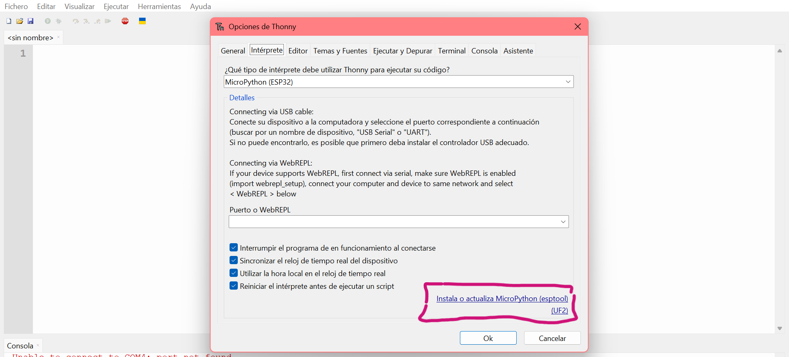


3. Borrado de memoria y grabación de firmware

**En la ventana emergente de instalación:**

1. Target port: Seleccionar el puerto COM asignado a la placa.

2. Erase all flash before installing: Marcar la casilla obligatoriamente. Esto elimina la configuración previa cargada por el entorno de Arduino.

3. MicroPython family / variant: Seleccionar **ESP32-S2** / **Wemos S2 mini**.

4. Hacer clic en **Instalar**.

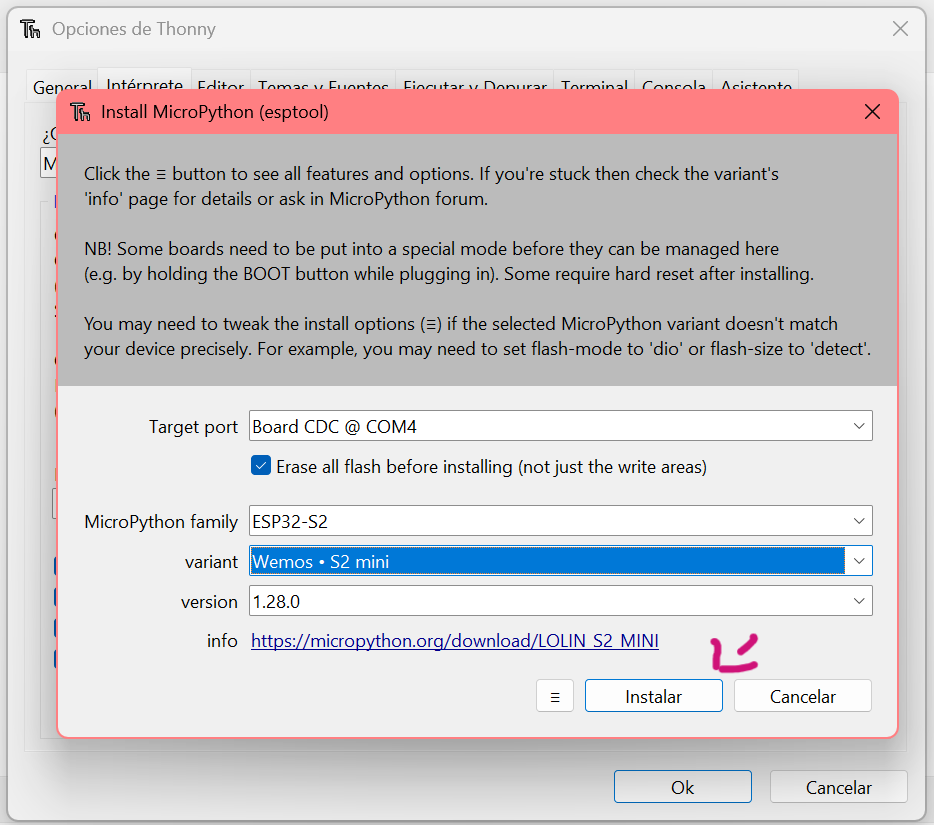

**Reinicio final**
Al completar la barra de progreso al 100%, cerrar las ventanas emergentes, presionar el botón **RST** una sola vez para arrancar el nuevo firmware e iniciar la comunicación por la consola de MicroPython.


<p align="right">
  <a href="#top">Back To Top</a>
</p>

---

## 6. 📝Lista de componentes

|             Componente          | Cantidad  |
|---------------------------------|-----------|
| Raspberry Pi 3 B+               |     1     | 
| Esp32 S2 Mini                   |     1     |
| Sensores VL53L0X                |     5     |
| MPU 6050                        |     1     |
| Batería LiPo 7.4V 75C           |     1     |
| Conversor Step Down 5v          |     1     |
| Puente H tb6612fng              |     1     |
| Switch                          |     1     |
| Cables unifilares               |   varios  |
| Conectores JST diferentes pines |   varios  |
| Rodamientos 608                 |     2     |
| Rodamientos 605                 |     2     |
| Servo MG90S                     |     1     |
| Micro motor dc 130 3V - 6V      |     1     |
| PerfBoard                       |     1     |
| Resistencias 1KΩ                |     3     |
| Resistencias 220KΩ              |     1     |
| Led                             |     1     |
| Regulador Lineal LM7805         |     1     |
| Capacitor 40 105 c              |     1     |
| Capacitor cerámico 10uf         |     1     |
| Conector xt60                   |     1     |
| Conector DC Plug                |     1     |
| Tornillos y tuercas: M3 y M4    |   varios  |
| Borneras                        |     4     |
| Terminales                      |     4     |
| Espadines hembra/macho          |   varios  |
| Eje 5mm                         |     1     |
| Cámara 1080p                    |     1     |
| Filamento PETG                  |     1     |
| Filamento TPU                   |     1     |

**Impresoras utilizadas:**

- Creality Ender 3 V3 SE


<p align="right">
  <a href="#top">Back To Top</a>
</p>

---

## 7. 💎Archivos de modelos 3D

### 7.1 Archivos STL

### 7.2 Archivos modificados

<p align="right">
  <a href="#top">Back To Top</a>
</p>

---

## 8. 🛠️Instrucciones de montaje

Pronto

<p align="right">
  <a href="#top">Back To Top</a>
</p>
